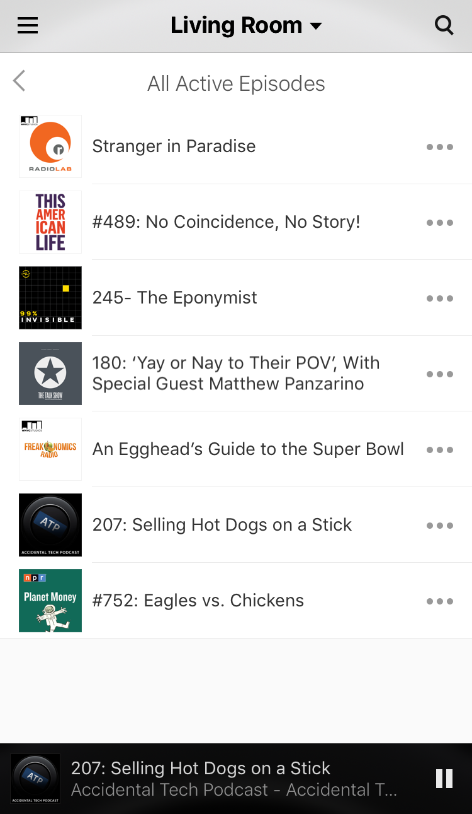
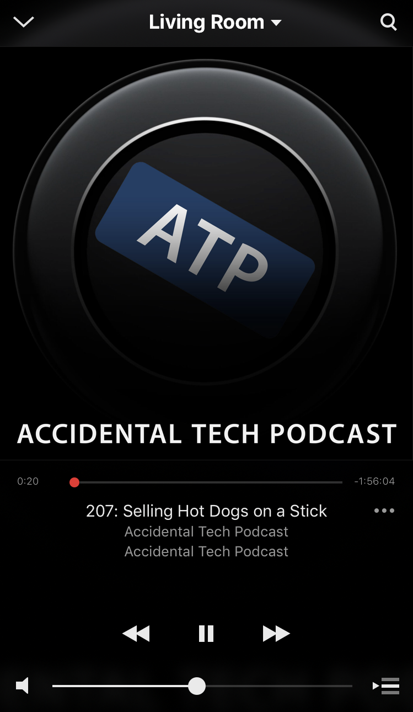
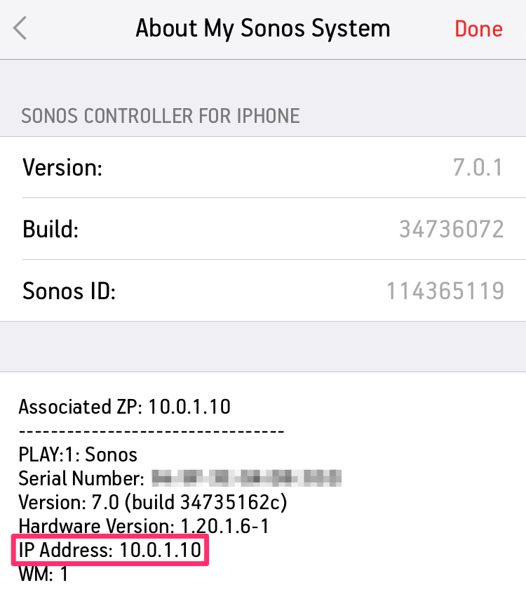
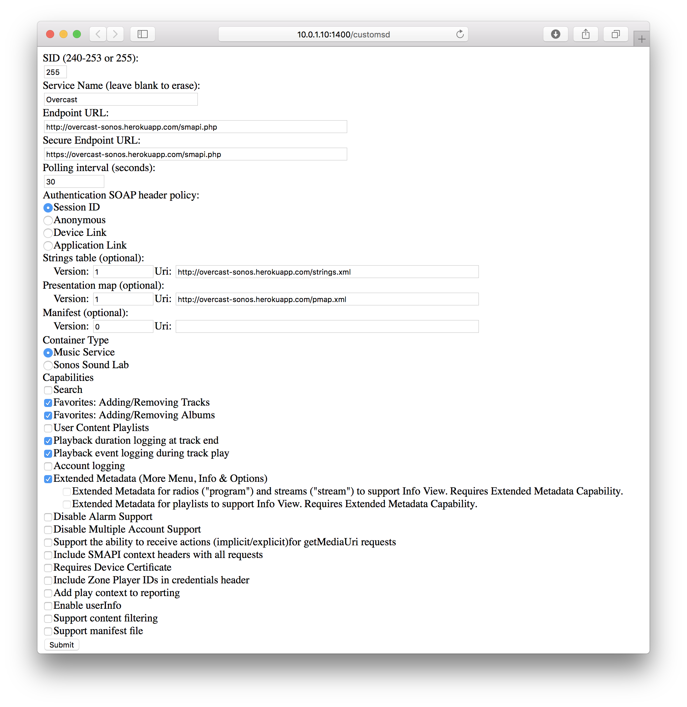

# Unofficial Overcast + Sonos integration

Listen to your Overcast podcasts on Sonos.

Just want to try it out? [Follow these setup instructions to register the Overcast service on your Sonos system](#setup).

## Setup

### Find the IP address of your Sonos.

From the iOS Sonos App, go to **Settings** > **About My Sonos System**.

[Check out this Sonos support article if you're on another platform.](https://sonos.custhelp.com/app/answers/detail/a_id/2626/)

### Register the custom service

Navigate to `http://$IP:1400/customsd`. For example, if your Sonos IP address was `10.0.1.10`, you'd navigate to `http://10.0.1.10:1400/customsd` in your web browser.

Fill out the custom service registration form with the following values.

### Add Music Service

From the iOS Sonos App, go to **Add Music Services** and find **Overcast** in the list. Log in with your [Overcast.fm](https://overcast.fm/login) email address and password.

## Questions and Answers

#### Is this an official Overcast service?

No.

#### Do I have to run this thing on my computer?

Unlike [AirSonos](http://airsonos.stephenwan.net/), you don't need to run any additional programs on your computer or network. A public instance of the service is already set up on Heroku.

#### Why can't I see my playlists?

This service is limited to the same functionality as the [overcast.fm website](https://overcast.fm/), which only supports the "All Active Episodes" playlist.

#### What does "registering a custom service" do?

[Sonos allows a unreviewed custom service to be registered for testing and development purposes](http://musicpartners.sonos.com/docs?q=node/134). It's similar to "sideloading" an iOS app via Xcode. Typically, all services are reviewed and registered with Sonos.

Keep in mind that only one custom service can be registered per network. Because of this limitation, you can't use this Overcast service and another like the [NPR One service](https://michaeldick.me/sonos-nprone/) at the same time.

#### Why isn't there a nice Overcast logo in the Sonos app?

Only officially registered services can [set a custom service logo](http://musicpartners.sonos.com/node/377).

#### Why PHP?

I thought it would be fun and maybe [@marcoarment](https://github.com/marcoarment) would take the source and make it official.

#### Can I run my own service?

Yeah! If you want to make modifications or want to control your own instance for privacy reasons, you can simply use this "Deploy to Heroku" button to quickly set up your own app in minutes.

